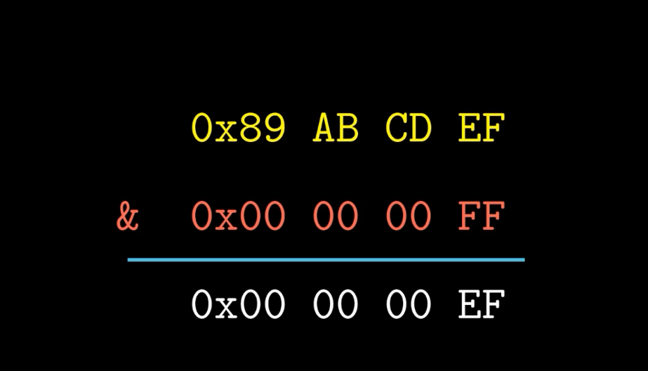

# 数据表示

## 比特(bit)
| 十六进制 | 十进制 | 二进制 |
| --- | --- | --- |
| 0 | 0 | 0000 |
| 1 | 1 | 0001 |
| 2 | 2 | 0010 |
| 3 | 3 | 0011 |
| 4 | 4 | 0100 |
| 5 | 5 | 0101 |
| 6 | 6 | 0110 |
| 7 | 7 | 0111 |
| 8 | 8 | 1000 |
| 9 | 9 | 1001 |
| A | 10| 1010 |
| B | 11| 1011 |
| C | 12| 1100 |
| D | 13| 1101 |
| E | 14| 1110 |
| F | 15| 1111 |

1. 运算 

    当A = 1 , B = 1:
    与(And): A&B = 1
    或(Or): A|B = 1
    非(Not): ~A = 0
    异或(Xor): A^B = 0
    左移Left shift: A<<1 = 2(10)

2. 逻辑

    & 交集: 
    | 并集: 
    ^ 差集: 
    ~ 补集: 

## 整型(integer)
- 无符号数B2U(X) = $\sum^{n-1}_{i=0} x_i 2^i$
- 有符号数B2T(X) = $-x_{n-1}2^{n-1} + \sum^{n-2}_{i=0} x_i 2^i$

1. 常见的数据类型

    | 类型 | 字节 |
    | ---  | --- |
    | char | 1 |
    | short| 2 |
    | int  | 4 |
    | float | 4 |
    | double| 8 |

2. 数据的地址存储

- 大端法
  01 23 45 67
- 小端法
  67 45 23 01

## 字符串
 a b c d e null

## 位运算
- 掩码

- 左移
- 逻辑右移
- 算数右移(最高位为1时需要补1)

