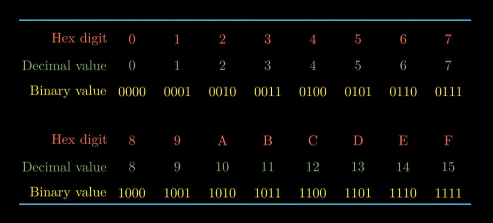
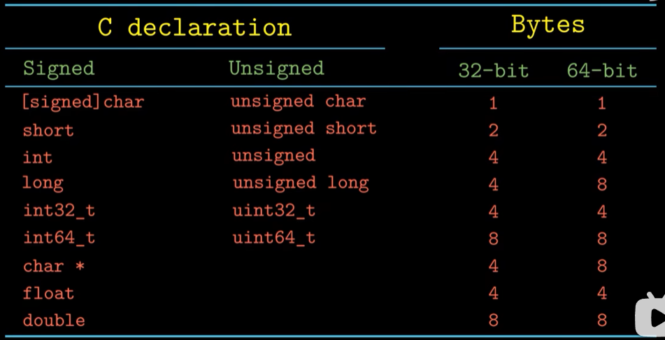
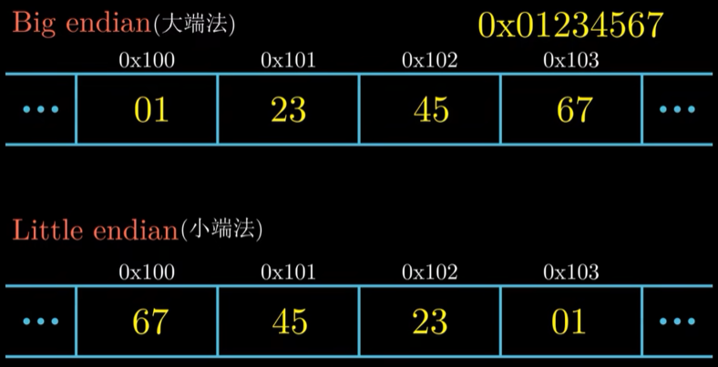
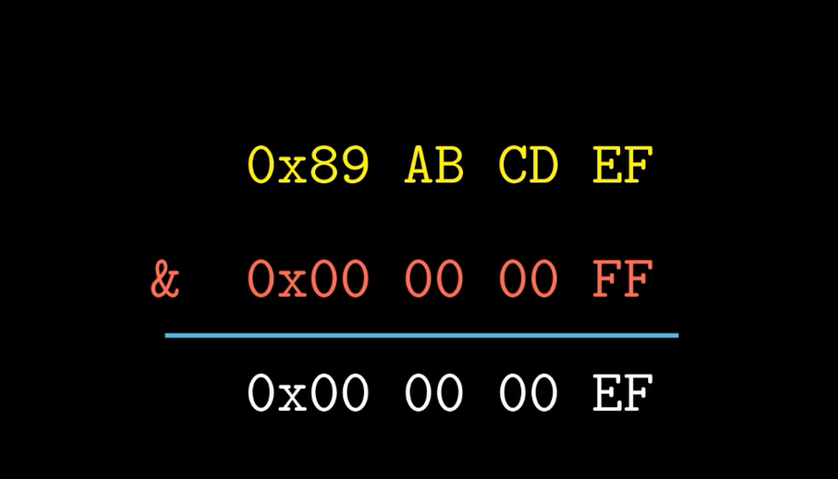
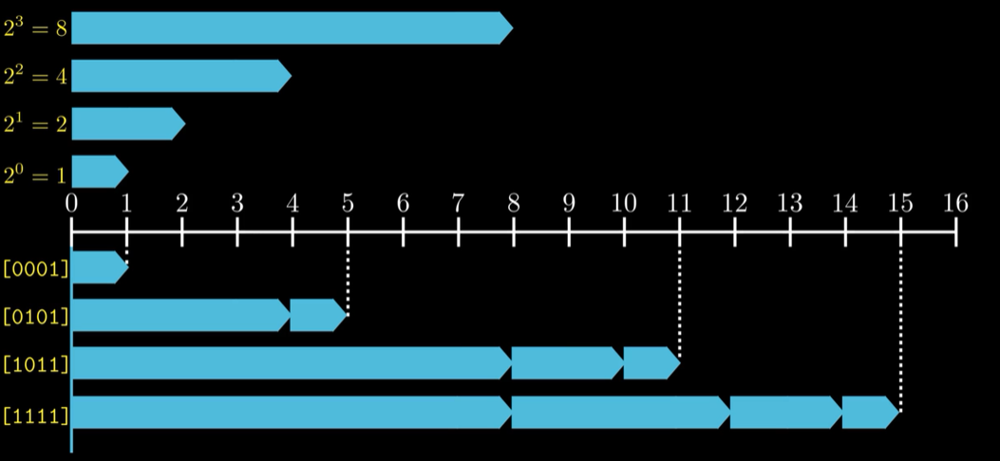
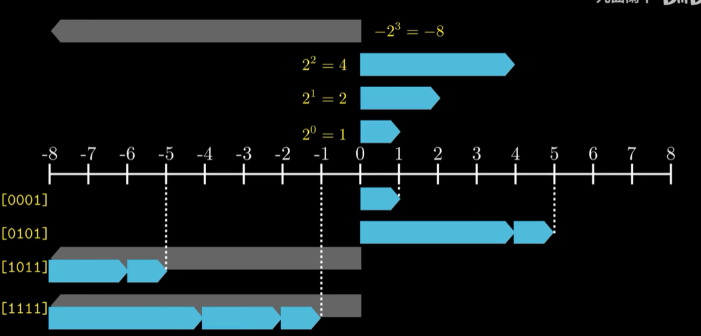
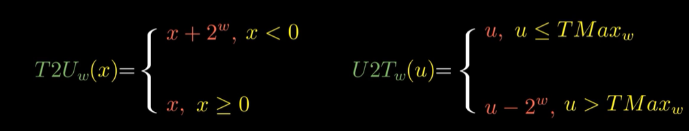
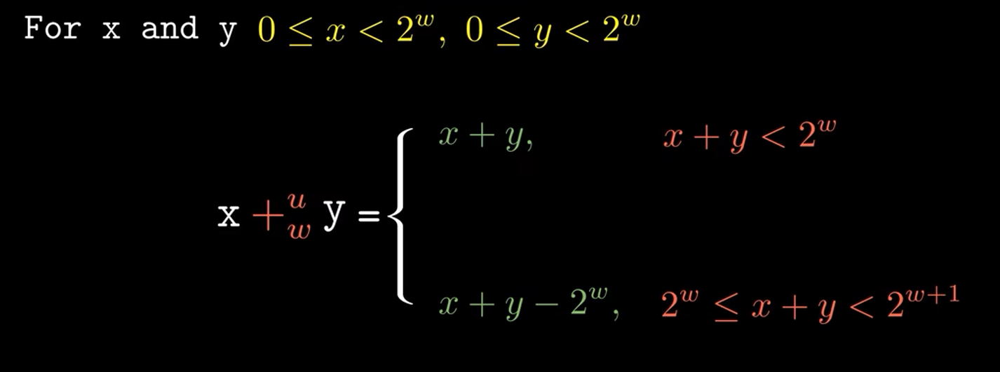
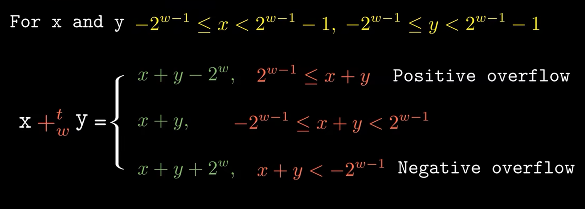

# 信息的存储

## 信息存储
### 位存储
1. Byte
2. 十六进制
    
3. 进制转化
    - 2 -> 16
    - 2 -> 10
    - 10 -> 2
    - 10 -> 16
    - 16 -> 2
    - 16 -> 10

4. 数据类型
    

5. 数据存储
    

### 位运算

1. 运算 

    当A = 1 , B = 1:
    与(And): A&B = 1
    或(Or): A|B = 1
    非(Not): ~A = 0
    异或(Xor): A^B = 0
    左移Left shift: A<<1 = 2(10)

2. 应用
   - 掩码

    - 左移
    - 逻辑右移
    - 算数右移(最高位为1时需要补1)

## 整数
### 表示
- 无符号数

- 补码=>有符号数

- 范围

| 字长为n | 无符号数 | 有符号数 |
| --- | --- | --- |
| 最大 | 2^n -1 | 2^(n-1)-1 |
| 最小 | 0 | -2^(n-1) |

**`-1`的表示不管n为多少,均表示为`111...111`.**
**`-1`的补码与`无符号数最大值UMax`相同**

### 转换

**小转大数值可以保持,大转小则不行**

### 运算
- 溢出overflow
- 无符号加法
  

- 有符号加法

