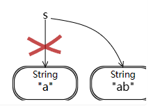
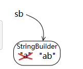
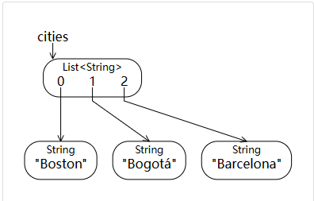
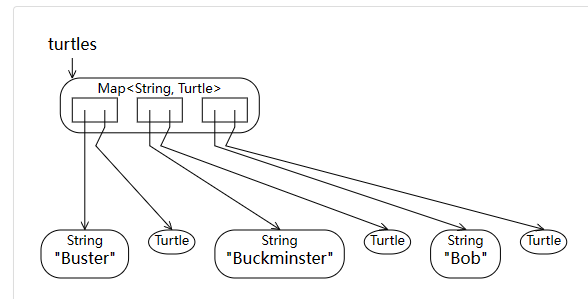
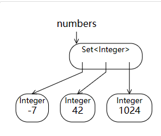

# Basic JAVA

## 更改变量和值
### 可变与不可变值
- `String` : 不可变
```java
String s = "a";
s = s + "b";
```


- `StringBuilder` : 可变
```java
StringBuilder sb = new StringBuilder("a");
sb.append("b");`
```



## JAVA Set / Map / List
### List

```java
list.size() //len(lst)
list.add(e) //lst.append(e)
if(list.isEmpty()) // if not lst
list.contains(e) // e in lst
```
### Map

```java
map.put(key, value) // map[key] = value
map.get(key) // map[key]
map.containsKey(key) // key in map
map.remove(key) // del map[key]
```
### Set

```java
set.contains(e) // e in set
set.containsAll(set2) // set.issuperset(set2)    set >= set2
set.removeAll(set2) // set.difference(set2)      set -= set2
```


