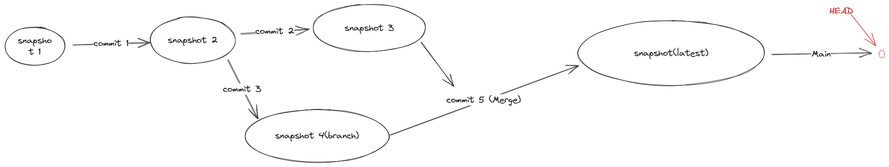

# version control
> learn to use Git
> about Git : https://git-scm.com/book/zh/v2
> How to learn it:https://csdiy.wiki/%E5%BF%85%E5%AD%A6%E5%B7%A5%E5%85%B7/Git/


## How to learn Git
## 如何学习 Git

和 Vim 不同，我不建议初学者在一知半解的情况下贸然使用 Git，因为它的内部逻辑并不能熟能生巧，而是需要花时间去理解。我推荐的学习路线如下：

1. 阅读这篇 [Git tutorial](https://missing.csail.mit.edu/2020/version-control/)，视频的话可以看这个[尚硅谷Git教程](https://www.bilibili.com/video/BV1vy4y1s7k6)
2. 阅读这本开源书籍 [Pro Git](https://git-scm.com/book/en/v2) 的 Chapter1 - Chapter5，是的没错，学 Git 需要读一本书（捂脸）。
3. 此时你已经掌握了 Git 的原理和绝大部分用法，接下来就可以在实践中反复巩固 Git 的命令了。但用好它同样是一门哲学，我个人觉得这篇[如何写好 Commit Message](https://chris.beams.io/posts/git-commit/) 的博客非常值得一读。
4. 好的此时你已经爱上了 Git，你已经不满足于学会它了，你想自己实现一个 Git！巧了，我当年也有这样的想法，[这篇 tutorial](https://wyag.thb.lt/) 可以满足你！
5. 什么？光实现一个 Git 无法满足你？小伙子/小仙女有前途，巧的是我也喜欢造轮子，这两个 GitHub 项目 [build-your-own-x](https://github.com/danistefanovic/build-your-own-x) 和 [project-based-learning](https://github.com/tuvtran/project-based-learning) 收录了你能想到的各种造轮子教程，比如：自己造个编辑器、自己写个虚拟机、自己写个 docker、自己写个 TCP 等等等等。


## Git tutorial
VCS是用于跟踪代码更改的工具,维护其元数据并促进协作
现代VCS以Git为标准
### Git Data Model
#### 快照
Git将一个顶级目录下的文件集合在时间历史上的总模型作为一系列快照。
文件被称为blob,视为一堆字节,目录称为tree,视为一个树形结构。
一个快照就是一颗正在跟踪顶层的树.
#### 快照的关联
历史记录是快照的有向无环图DAG:
```
c1 -- c2 -- c3
        ^-- b3 -- b4

o <-- o <-- o
      ^
      \
       --- o <-- o

// 在第三次提交时产生了branch

o <-- o <-- o < --- **o**
      ^              /
      \             /
       --- o <-- o

// 合并提交后
```

这样就形成了Git Tree


#### 对象与内容索引
Git 的对象有 blob , tree, commit 三种类型
* blob 对象存储文件内容
* tree 对象存储目录树
* commit 对象存储提交信息

均使用[SHA=1 hash](https://en.wikipedia.org/wiki/SHA-1)索引:

``id = sha1(obj)``

#### 引用
Git将一个指针指向哈希对象
如master,HEAD
`tips:现在github将master名称更新为了main名称`

#### 仓库(repo)
将对象和引用统一的存储在磁盘上,这一集合体就是git repo

### Staging Area
通过暂存区机制让你指定拿一些修改应该包含在下一个快照中


### command


## Basics

- `git help <command>`: get help for a git command
- `git init`: creates a new git repo, with data stored in the directory`.git`
- `git status`: tells you what’s going on
- `git add <filename>`: adds files to staging area
- `git commit`: creates a new commit
    - Write [good commit messages](https://tbaggery.com/2008/04/19/a-note-about-git-commit-messages.html)!
    - Even more reasons to write [good commit messages](https://chris.beams.io/posts/git-commit/)!
- `git log`: shows a flattened log of history
- `git log --all --graph --decorate`: visualizes history as a DAG
- `git diff <filename>`: show changes you made relative to the staging area
- `git diff <revision> <filename>`: shows differences in a file between snapshots
- `git checkout <revision>`: updates HEAD and current branch

## Branching and merging

- `git branch`: shows branches
- `git branch <name>`: creates a branch
- `git checkout -b <name>`: creates a branch and switches to it
    - same as `git branch <name>; git checkout <name>`
- `git merge <revision>`: merges into current branch
- `git mergetool`: use a fancy tool to help resolve merge conflicts
- `git rebase`: rebase set of patches onto a new base

## Remotes

- `git remote`: list remotes
- `git remote add <name> <url>`: add a remote
- `git push <remote> <local branch>:<remote branch>`: send objects to remote, and update remote reference
- `git branch --set-upstream-to=<remote>/<remote branch>`: set up correspondence between local and remote branch
- `git fetch`: retrieve objects/references from a remote
- `git pull`: same as `git fetch; git merge`
- `git clone`: download repository from remote

## Undo

- `git commit --amend`: edit a commit’s contents/message
- `git reset HEAD <file>`: unstage a file
- `git checkout -- <file>`: discard changes

# Advanced Git

- `git config`: Git is [highly customizable](https://git-scm.com/docs/git-config)
- `git clone --depth=1`: shallow clone, without entire version history
- `git add -p`: interactive staging
- `git rebase -i`: interactive rebasing
- `git blame`: show who last edited which line
- `git stash`: temporarily remove modifications to working directory
- `git bisect`: binary search history (e.g. for regressions)
- `.gitignore`: [specify](https://git-scm.com/docs/gitignore) intentionally untracked files to ignore