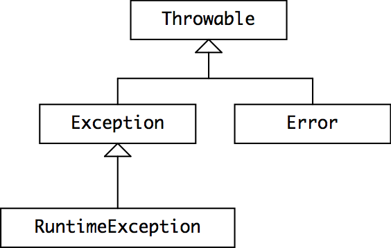

# Specifications
# specifications(规范)

## 目标
- 了解方法规范中的前提条件和后置条件，并能够编写正确的规范
- 能够根据规范编写测试
- 了解Java中已检查和未检查的异常之间的区别
- 了解如何将异常用于特殊结果

## 为什么要规范
- 精确规范可以分摊责任
- 规范省去了读取代码的任务
- 规范使实现者可以自由地更改实现而无需告知客户

```java
static int findFirst(int[] a, int val) {
    for (int i = 0; i < a.length; i++) {
        if (a[i] == val) return i;
    }
    return a.length;
}

static int findLast(int[] a, int val) {
    for (int i = a.length - 1 ; i >= 0; i--) {
        if (a[i] == val) return i;
    }
    return -1;
}

```
对应的规范是：
```java
static int find(int[] arr, int val)
  requires: val occurs exactly once in arr
  effects : returns index i such that arr[i] = val
```

## 规范的组成
- 一个先决条件
  - `requires`
- 一个后置条件
  - `effects`
- 如果不满足先决条件，则允许任何实现
  - 但最好选择抛出异常
  - 因为快速失败原则
  
## java 规范
- Java有一个文档注释约定
  - 参数由`@param`子句描述(应该在可能的情况下将前置条件放入`@param`)
  - 结果由`@return`和`@throws`子句描述(将后置条件放入`@return`和`@throws`)。
```java
static int find(int[] arr, int val)
  requires: val occurs exactly once in arr
  effects:  returns index i such that arr[i] = val
```
在java中是
```java
/**
 * Find a value in an array.
 * @param arr array to search, requires that val occurs exactly once
 *            in arr
 * @param val value to search for
 * @return index i such that arr[i] = val
 */
static int find(int[] arr, int val)
```

## 避免使用空引用
```java
//基本变量不能为null
int size = null;     // illegal
double depth = null; // illegal
//非基本变量可以为null
String name = null;
int[] points = null;
//但会出错
name.length()   // throws NullPointerException  
points.length   // throws NullPointerException
//null这与空字符串""或空数组不同

//非原始数组和类似的数组List可能不是null，但包含null作为值
String[] names = new String[] { null };
List<Double> sizes = new ArrayList<>();
sizes.add(null);
//这些null可能会导致错误。

```
- 空值非常麻烦且不安全，以至于建议您从设计词汇表中删除它们
- 在参数和返回值中隐式禁止使用空值
```java
static boolean addAll(@NonNull List<T> list1, @NonNull List<T> list2)
```

## 规范应该会谈论什么
- 方法的参数和返回值
- 不应该谈论局部变量或方法类的私有字段

## 测试也要遵从规范
- 不要做超出规范的假设
- 一个好的单元测试仅关注单个规范

## 异常

### 信号错误的例外
- `ArrayIndex­OutOfBounds` 超出数组的有效范围
- `ArithmeticException`，抛出诸如整数除零之类的算术错误。
- `NumberFormatException`，由方法抛出，例如，Integer.parseInt如果传入无法解析为整数的字符串。
- `NullPointerException`尝试在null对象引用上调用方法

### 特殊结果的例外
```java
LocalDate lookup(String name) throws NotFoundException {
    ...
    if ( ...not found... )
        throw new NotFoundException();
    ...
```

### 异常的作用
- 特殊结果
  - 使用 `checked exceptions`
  - 如果方法可能引发检查异常，则必须在其签名中声明可能性
  - 一个方法调用了另一个可能引发检查异常的方法，则它必须处理该异常
- 检测`bug`
  - 使用 `unchecked exceptions`
  - 不希望声明它抛出的所有与错误相关的异常
    - 索引超出范围，空指针，非法参数，断言失败等
  - 编译器将不检查`try- catch`或`throws`声明
  - Java仍然允许编写 `unchecked exceptions` 的子句，但这没有效果，我们不建议这样做。

### Java异常的类层次结构

- `Throwable` 是可以抛出或捕获的对象的类别
- `Error` 是 `Throwable` 的子类，`Java` 运行时系统产生的错误，例如 `StackOverflowError` 和 `OutOfMemoryError`
  - `AssertionError` 也会扩展 `Error`
  - 应该被认为是不可恢复的
  - `Error`及其子类是 `unchecked exceptions`。编译器不需要在 `throws` 将它们引发的方法的子句中声明它们，也不需要此类方法的调用者捕获或声明它们。
- 所有其他 `throwable - Throwable`
  - `Exception` 是`checked exceptions` (`RuntimeException` 和 `Error` 是 `unchecked exceptions`)。
  - 编译器要求在可能的情况下捕获或声明这些异常。
- 当定义自己的异常时，应该子类 `RuntimeException`（使之成为`unchecked exceptions`）或 `Exception`（使之成为`checked exceptions`）。
- 程序员通常不会继承`Error`或`Throwable`，因为它们是`Java`本身保留的。

### 异常设计注意事项

- `unchecked exceptions` 用于检测 `bug`,错误,意外失败
- `checked exceptions` 用于特殊结果
- 不要滥用 `exceptions`

```java
try {
    int i = 0;
    while (true)
        a[i++].f();
} catch (ArrayIndexOutOfBoundsException e) { }

// 可以用这个替代
for (int i = 0; i < a.length; i++) {
    a[i].f();
}
//在典型的机器上，从0循环到99时，基于异常的惯用语比标准惯用语慢70倍。
```

## 总结
- 安全的错误。
  - 一个好的规范清楚地记录了客户和实施者所依赖的相互假设。
  - 错误通常来自于接口上的分歧，而规范的存在可以减少这种情况。
  - 在规范中使用机器检查的语言功能，例如静态类型和异常，而不仅仅是人类可读的注释，可以进一步减少错误。
- 容易理解。
  - 简短，简单的规范比实现本身更易于理解，并且使其他人不必阅读代码。
- 准备改变。
  - 规范在代码的不同部分之间建立关系，只要这些部分继续满足要求，它们就可以独立更改。

