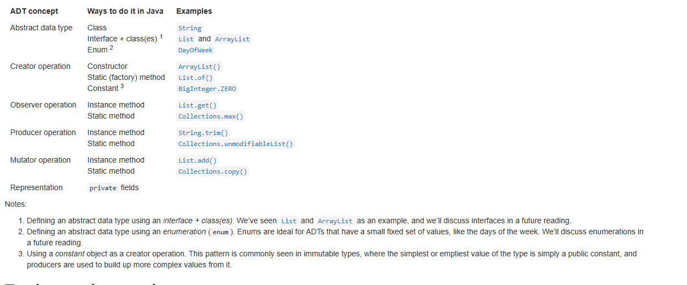

# Abstract Data Types
# 数据类型抽象
## 抽象的意义
- 抽象:用简单的理念省略低级的细节
- 模块化:划分系统
- 封装:只对内部负责
- 隐藏:隐藏细节
- 分离:分离功能

## 抽象类型的操作
- 可变和不可变

四种操作者:
- Creators(创建者): 使用其它参数创建新对象
- Producers(生产者): 使用现有对象创建新对象
- Observers(观察者): 接受抽象对象返回其它对象
- Mutators(转换者): 改变对象
- 可以用以下形式表示（T 代表抽象类型本身， t 代表其他类型， + 代表出现 >= 1 次， * 代表出现 >= 0 次，| 代表或）
  - creator : t* → T
    - `>= 0` 个其他类型，产生了抽象类型 T
    - 构造器 `constructor`，` new ArrayList()`
    - 也可以是个静态方法 `Arrays.asList()`
      - 由静态方法实现 `creator` 称为 **工厂方法**
      - `String.valueOf(参数)` 把参数变量变为 String，也是工厂方法
  - producer : T+, t* → T
    - `>= 1` 本类型和 `>= 0` 个其他类型，产生了抽象类型 T
    - `concat` : `String × String → String`
  - observer : T+, t* → t
    - `>= 1` 本类型和 `>= 0` 个其他类型，产生了其他类型 t
    - `size` : `List → int`
    - `regionMatches()` （用于检测两个字符串在一个区域内是否相等） : ` String × boolean × int × String × int × int → boolean`
  - mutator : T+, t* → void | t | T
    - `>= 1` 本类型和 `>= 0` 个其他类型，改变了本类型 T 的情况，产生的任意可能的输出
    - 返回为 `void` 通常是 mutator 的信号
  


## 抽象数据类型设计(Eg)
```java
/** MyString represents an immutable sequence of characters. */
public class MyString { 

    //////////////////// Example of a creator operation ///////////////
    /**
     * @param b a boolean value
     * @return string representation of b, either "true" or "false"
     */
    public static MyString valueOf(boolean b) { ... }

    //////////////////// Examples of observer operations ///////////////
    /**
     * @return number of characters in this string
     */
    public int length() { ... }

    /**
     * @param i character position (requires 0 <= i < string length)
     * @return character at position i
     */
    public char charAt(int i) { ... }

    //////////////////// Example of a producer operation ///////////////    
    /** 
     * Get the substring between start (inclusive) and end (exclusive).
     * @param start starting index
     * @param end ending index.  Requires 0 <= start <= end <= string length.
     * @return string consisting of charAt(start)...charAt(end-1)
     */
    public MyString substring(int start, int end) { ... }

    /////// no mutator operations (why not?)
}
```

## ADT的概念



## Summary
- [](http://web.mit.edu/6.031/www/sp21/classes/10-abstract-data-types/#@abstract_data_types_characterized_their_operations)Abstract data types are characterized by their operations.
- Operations can be classified into creators, producers, observers, and mutators.
- An ADT’s specification is its set of operations and their specs.
- A good ADT is simple, coherent, adequate, and representation independent.
- An ADT is tested by generating tests for each of its operations, but using the creators, producers, mutators, and observers together in the same tests.

[](http://web.mit.edu/6.031/www/sp21/classes/10-abstract-data-types/#@these_ideas_connect)These ideas connect to our three key properties of good software as follows:

- [](http://web.mit.edu/6.031/www/sp21/classes/10-abstract-data-types/#@safe_bugs_good)**Safe from bugs.** A good ADT offers a well-defined contract for a data type, so that clients know what to expect from the data type, and implementers have well-defined freedom to vary.
    
- [](http://web.mit.edu/6.031/www/sp21/classes/10-abstract-data-types/#@easy_understand_good)**Easy to understand.** A good ADT hides its implementation behind a set of simple operations, so that programmers using the ADT only need to understand the operations, not the details of the implementation.
    
- [](http://web.mit.edu/6.031/www/sp21/classes/10-abstract-data-types/#@ready_change_representation)**Ready for change.** Representation independence allows the implementation of an abstract data type to change without requiring changes from its clients.