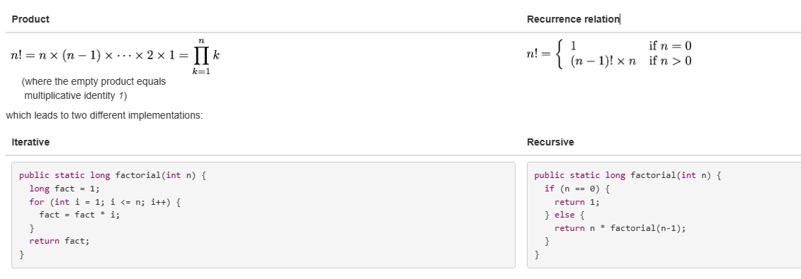
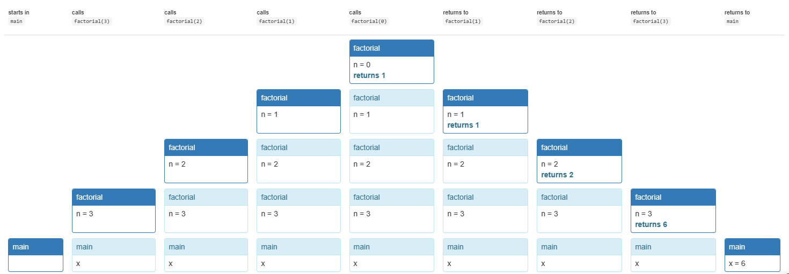

# 递归
> - 了解递归问题,将其分解为递归步骤和基础样例
> - 知道何时使用辅助方法
> - 了解递归和迭代两者的优缺点


## 递归
递归是根据基例和递归步骤定义的
借助对同一函数的多次调用来计算结果,但复杂度要更低
eg:


该递归调用的堆栈图如下:


## 如何正确的拆解问题

**如何使用递归实现一个subseq方法**
```java
/**
 * @param word consisting only of letters A-Z or a-z
 * @return all subsequences of word, separated by commas,
 * where a subsequence is a string of letters found in word 
 * in the same order that they appear in word.
 */
public static String subsequences(String word)
```
**递归分解**
```java
public static String subsequences(String word) {
 2     if (word.isEmpty()) {
 3         return ""; // base case
 4     } else {
 5         char firstLetter = word.charAt(0);
 6         String restOfWord = word.substring(1);
 7         
 8         String subsequencesOfRest = subsequences(restOfWord);
 9         
10         String result = "";
11         final int withTrailingEmptyStrings = -1; // see String.split() spec
12         for (String subsequence : subsequencesOfRest.split(",", withTrailingEmptyStrings)) {
13             result += "," + subsequence;
14             result += "," + firstLetter + subsequence;
15         }
16         result = result.substring(1); // remove extra leading comma
17         return result;
18     }
19 }
```

## 递归的实现结构
- base case基例 : 问题中最小最简单的一个实例
- 递归步骤 : 将一个大的问题拆分为更小的问题或者实例 , 然后组合起来解决问题


## 辅助方法
- 通过对递归进行一个更强的要求 , 使得递归更加简单


```java
/**
 * Return all subsequences of word (as defined above) separated by commas,
 * with partialSubsequence prepended to each one.
 */
private static String subsequencesAfter(String partialSubsequence, String word) {
    if (word.isEmpty()) {
        // base case
        return partialSubsequence;
    } else {
        // recursive step
        return subsequencesAfter(partialSubsequence, word.substring(1))
             + ","
             + subsequencesAfter(partialSubsequence + word.charAt(0), word.substring(1));
    }
}

public static String subsequences(String word) {
    return subsequencesAfter("", word);
}
```


- **不要公开你的辅助方法**
- **可变的静态变量数据以及别名 对你的递归十分不安全** : 安全的传入变量并且坚持使用不可变对象

## 选择正确的递归子问题
- 将 整数转化为具有给定基数的字符串表示:

```java
/**
 * @param n integer to convert to string
 * @param base base for the representation. Requires 2<=base<=10.
 * @return n represented as a string of digits in the specified base, with 
 *           a minus sign if n<0.
 */
public static String stringValue(int n, int base)
```

```java
// 负数处理的方法
if (n < 0) return "-" + stringValue(-n, base);
```

- 如何分解递归为子问题
  - 取最右边的数，原数除以最右边的数
  
```java
return stringValue(n/base, base) + "0123456789".charAt(n%base);
```

最终写法：

```java
/**
 * @param n integer to convert to string
 * @param base base for the representation. Requires 2<=base<=10.
 * @return n represented as a string of digits in the specified base, with 
 *           a minus sign if n<0.  No unnecessary leading zeros are included. 
 */
public static String stringValue(int n, int base) {
    if (n < 0) {
        return "-" + stringValue(-n, base);
    } else if (n < base) {
        return "" + n; 
    } else {
        return stringValue(n/base, base) + "0123456789".charAt(n%base);
    }
}
```

## 递归问题 vs. 递归数据
> 对于一些本来就是递归的数据(比如文件系统)
> [](http://web.mit.edu/6.031/www/sp21/classes/14-recursion/#@java_library_represents)The Java library represents the file system using [`java.io.File`](http://docs.oracle.com/en/java/javase/15/docs/api/java.base/java/io/File.html). This is a recursive data type, in the sense that `f.getParentFile()` returns the parent folder of a file `f`, which is a `File` object as well, and `f.listFiles()` returns the files contained by `f`, which is an array of other `File` objects.

tips : 最新的java中添加了`java.nio.Files` & `java.nio.Path`提供了更加清晰的文件系统与路径,但本质上仍然是一种递归数据

## 相互递归
> 在这种情况下 , Ａ　与　B 相互递归调用操作 , 叫做相互递归

## 可重入代码(Reentrant Code)

> 可重入代码 : 允许安全的重新输入 , 即使他在调用
> 其状态完全的保留在参数和局部变量中
> 在并发中 , 并发程序的不同部分可能同时调用一个方法 , 因此也存在重入.
> 将代码设计为可重入, 可以更加安全的避免错误

## 使用递归而不是迭代的时机
- 使用递归的原因: 1. 问题是递归的 2. 数据是递归的 3. 需要利用其不变性
- 使用递归的缺点 : 占用空间更多 ; 建立递归调用堆栈,会消耗内存并且堆栈大小是有限制的

## 递归实现中的常见错误
- 基本案例丢失
- 递归步骤不会减少到较小的子问题 , 因此递归不收敛
- 递归无限循环 , 变为stackoverflowerror


## 总结
- 递归问题和递归数据
- 递归问题的替代分解
- 使用辅助方法来加强递归步骤
- 递归与迭代

- 满足以下三个优质软件的方便属性
  - 避免错误。 
    - 递归代码更简单，并且经常使用不可变变量和不可变对象。
  - 容易理解。 
    - 对于自然递归问题和递归数据的递归实现通常比迭代解决方案更短，更容易理解。
  - 准备好进行更改。 
    - 递归代码也是自然可重入的，这使得它更安全，免受错误影响，并可以在更多情况下使用。
  
