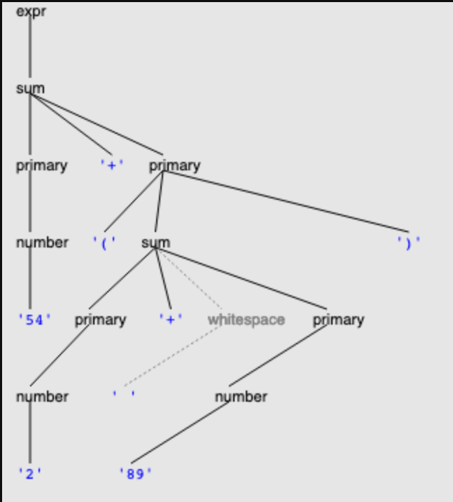

# 解析器
## 解析生成器
> 根据语法接收字符序列并进行匹配

通过生成解析树,分析语法解析器的运行过程
[ParserLib](http://6031.mit.edu/parserlib/3.2.0/doc/)

### parserlib语法
每条parserlib规则都由`名称` , `::=` , `定义` , `;`组成
还可以包含java注释
eg :`text ::= [^<>]+; /*`

按照惯例使用小写来表示非终结符,使用带引号的字符串表示终结符.与普通的正则不同,parserlib要求字面的字符必须使用引号或者字符括号括起来: `(alpha|beta|[c-z])*` => `('alpha'|'beta'|[c-z])*`

### 空白
可以改写语法来判定空格是否需要
但parserlib允许使用速记法来表示应该跳过的字符
```java
@skip whitespace{
    expr ::= sum;
    sum ::= prim ('+' prim)*;
    prim ::= num | '(' sum ')';
}
whitespace ::= [ \t\r\n]+ ;
num ::= [0-9]+;
```
@skip表示与whitespace非终端的匹配将被忽略,因此以上语法实际变成了:
```java
expr ::= whitespace* sum whitespace* ;
sum ::= whitespace* primary whitespace* (whitespace* '+' whitespace* primary whitespace*)* whitespace* ;
primary ::= whitespace* number whitespace* | whitespace* '('  whitespace* sum  whitespace* ')' whitespace* ;
```


## 生成解析
```java
import edu.mit.eecs.parserlib.*;

private static enum IntegerGrammar {
    EXPR , SUM ,PRIMARY , NUMBER , WHITESPACE
}

Parser<IntegerGrammar> parser = 
    Parser.compile(new File("src/intexpr/IntegerExpression.g") , IntegerGrammar.EXPR);
```

这段代码将IntegerExpression.g文件打开并编译为一个Parser对象,第二个参数传入一个语法的根非终端名称,此处使用由IntegerGrammar枚举中参数化的EXPR

## 调用解析器
```java
//生成解析树
ParseTree<IntegerGrammar> tree = parser.parse("54+(2+ 89)");

//打印解析树
System.out.println(tree.toString());
```


## 遍历解析树
构建解析树,遍历其叶子节点

## 构造抽象语法树
将解析树转换为递归的数据类型.
$$IntegerExp = Number(n:int) + Plus(left:IntegerExp , right:IntegerExp)$$

IntegerExp由分组和整数构成,形成了抽象语法树.而具体语法树包含了更多如何用实际字符表示的细节.
例如2+2,(2)+(2),002+002代表不同的具体语法树而都对应一个抽象语法树Plus(number(2),number(2))

以下是如何使用递归函数让ParseTree生成IntegerExpression的过程:
```java
/**
 * 将一颗解析树转换为抽象语法树
 *
 * @param ParseTree 是由InterExp.g构建而成的语法解析树
 * @return abstract syntax tree 由ParseTree转化而成
 */
private static IntegerExp makeAbstractSyntaxTree(final ParseTree<IntegerGrammar> parseTree){

    switch(parseTree.name()){
        case EXPR: // expr ::= sum;
        {
            final ParseTree<IntegerGrammar> child = parseTree.children().get(0);
            return makeAbstractSyntaxTree(child);
        }
        case SUM: //sum ::= prim ('+' prim)*;
        {
            final List<ParseTree<IntegerGrammar>> children = parseTree.children();
            IntegerExpression expression = makeAbstractSyntaxTree(children.get(0));
            for(int i = 1;i < children.size(); ++i){
                expression = new Plus(expression , makeAbstractSyntaxTree(children.get(i)));
            }
            returtn expression;
        }
        case PRIMARY: //primary ::= number | '(' sum ')';
        {
            final ParseTree<IntegerGrammar> child = parseTree.children().get(0);
            switch (children.name()){
                case NUMBER:
                    return makeAbstractSyntaxTree(child);
                case SUM:
                    return makeAbstractSyntaxTree(child);
                default:
                    throw new AssertionError("should never get here");
            }
        }

        case NUMBER: // number ::= [0-9]+;
            {
                final int n = Integer.parseInt(parseTree.text());
                return new Number(n);
            }
        default:
            throw new AssertionError("should never get here");
    }
}
```

## 错误处理
- 语法文件不存在或无法打开 : IOException
- 语法可能由语法错误 : UnableToParseException
- 试图解析的字符串无法用给定的语法解析 : UnableToParseException


## ParserLib限制
ParserLib的原理是生成一个自顶向下的递归向下解析器,存在一定的限制:
- [左递归](https://en.wikipedia.org/wiki/Left_recursion): 如果语法涉及了左递归,那么可能出现一些问题,因为在调用右式进行匹配时,会立即对其内容进行匹配,此时会不断递归尝试该规则,如`sum ::= num | sum '+' num;`然而在sum不作为第一个符号时,该式则不属于左递归,因为语法可以得到进展.
    > 解决方法:改写为重复符号`sum ::= (num'+')* num;`

- [贪心]():ParserLib是贪婪的,在每一个点上都会考虑为当前考虑的规则匹配一个最大的字符串,如:`g ::= ab threeb;` , `ab ::= 'a'*'b'*;` , `threeb ::= 'bbb';`我们有串'aaaabbb',显然符合g的语法,但在匹配ab索引的时候,解析器会匹配`a*b*`的最大串,等到解析threeb的时候,串已经被消耗干净了.

# Summary
- [](http://web.mit.edu/6.031/www/sp21/classes/18-parsers/#@safe_bugs_grammar)**Safe from bugs.** A grammar is a declarative specification for strings and streams, which can be implemented automatically by a parser generator. These specifications are often simpler, more direct, and less likely to be buggy than parsing code written by hand.
    
- [](http://web.mit.edu/6.031/www/sp21/classes/18-parsers/#@easy_understand_grammar)**Easy to understand.** A grammar captures the shape of a sequence in a form that is compact and easier to understand than hand-written parsing code.
    
- [](http://web.mit.edu/6.031/www/sp21/classes/18-parsers/#@ready_change_grammar)**Ready for change.** A grammar can be easily edited, then run through a parser generator to regenerate the parsing code.