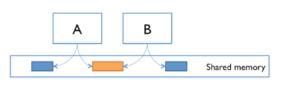
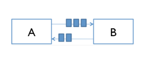
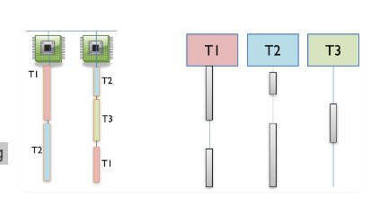

# 并发
> - 并发的消息传递
> - 共享内存模型
> - 并发进程与线程 , 以及时间分片
> - 条件竞争的危险

## 并发
并发意味着同时进行多个计算

### 两种并发编程模型
- **共享内存** : 并发模块通过一块共享的内存空间进行交互

- **信息传递** : 并发模块通过通信通道相互发送消息进行交互


### 进程 , 线程  , 时间切片
> 并发模块本身分为进程和线程

- 进程 : 进程是一个独立的运行实例de'e,和其它进程相互隔离

进程实际上是一种抽象的虚拟计算机,它使得程序运行在一个专属的空间中

- 线程 : 线程是程序运行中的一个控制点,多个线程共享了一整个进程

线程抽象代表一个虚拟处理器,这个处理器与其它处理器使用同样的内存来运行相同的程序的不同阶段

- 时间切片 : 当线程多于处理器时,并发性通过将时间进行切片来模拟


## Thread in java
```java
new Thread(new Runnable(){
    public void run() {
        System.out.println("hello from a thread!");
    }
}).start();
// 使用匿名类来启动一个线程
// lambda : new Thread( () -> print("hello") ).start();
```
### 匿名类
- 优势 : 只需要在定义它的地方使用它,只需要在使用它的地方定义它
- 缺点 : 无法多次使用,可读性较差

## Example : 共享内存
> 假设有一个银行账户,使用多个ATM进行存取交易,每次存入一元然后再取出一元

在一天结束后,账户余额从逻辑上讲应该仍然为0.
然而在多线程代码运行中,结束时可能不为0.

### 交错(Interleaving)
例如,当A机器和B机器同时存入一美元时,是有可能发生这样的情况:
```
A               | B
查询余额(0元)    
                | 查询余额(0元)
存入1元          
                | 存入1元
写回(1元)       
                | 写回(1元)
```
由于A和B在计算时不能考虑内存的新变化出现了错误

### 竞争
这就是竞争
竞争意味着事件计算的相对事件将会影响程序的正确

而你无法通过调整代码来影响竞争的发生 !!!
因为代码并不是计算机执行的原子操作,经过编译器处理后它是可分的

实际上发生的事情更加难以预测,你所使用的多个变量在多个处理器中出现的顺序并不按照你所要求的进行,因为编译器仍然会按照更快的方法计算以及回存变量

## Example : 信息传递
> 现在我们用多台ATM对多个账户进行操作,方法如下:
> 每台机器在处理时向存取账户发送需要的信息请求(读取余额写回余额) , 而一个账户会同时收到多台机器的请求,它会将这些请求排入队列一个一个处理,此时机器也可以去处理其它账户

交错的情况再次出现了,竞争仍然没有避免

# 并发编程实在是难以测试难以debug
- [heisenbugs](https://en.wikipedia.org/wiki/Heisenbug) : 非确定的,难以复现的
- [bohrbug]() : 确定的

