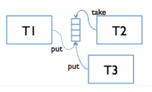

# 队列与消息传递

> 在消息传递的并发模型中 , 并发模块通过信道传递消息来交互

## 线程之间的消息传递

具有阻塞操作的消息队列 : `BlockingQueue`
- add(e) : 添加到队尾(先进)
- remove() : 删除队首元素(先出)
- 检索队列由空变为非空
- 检索队列由满变为非满
- put(e) : 阻塞队列 直到 e可以被添加到队伍
- take() : 阻塞队列 直到 队伍首部元素可以被删除

### 生产者 - 消费者设计模式

生产者和消费者线程共享一个队列, 生产者负责将数据请求放入队列 , 消费者负责移除处理这些数据请求.

java-BlockingQueue的两种实现 :
- ArrayBlockingQueue : 使用数组表示固定大小的队列.
- LinkedBlockingQueue : 使用链表表示可变大小的队列

生产者和消费者将会使用我们设计的通信消息类型进行通信

## message-passing example
[zip](./ex23-fridge.zip)
[code](./23code_example.md)

```DrinksFridge.java
function(qin , qout){

}
```

```DrinkFridge.start()
public void start(){
    new Thread(new Runnable() {
        public void run(){
            while(true){
                try{
                    int n = in.take();
                    FridgeResult result = handleDrinkRequest(n);
                    out.put(result);
                }
                catch(InterruptedException ie){
                    ie.printStackTrace();
                }
            }
        }
    }).start();
}

```
```DrinksFridge.handleDrinkRequest()
private FridgeResult handleDrinkRequest(int n){
    ...
    return new(FridgeResult(change , drinksInFridge));
}
```
```FridgeResult.java

```

### 停止
- 使用毒药 : 队列上的特殊消息(例如0)
- 调用线程的interrupt

### 消息传递的线程安全讨论
- 队列现有的数据类型是线程安全的
- 多个线程访问的消息数据是不可变的
- 数据限制在单个生产者和消费者中
- 限制了通过队列发送的可变消息数据

## 竞争
消息队列的阻塞也引入了死锁的可能性.

### 阻止死锁的最终建议
- 设计系统使其不存在循环的可能性 : 只要A在等待B,那么就不允许B等待A
- 设计超时 : 只要模块被阻塞时间过长 , 那么就停止阻塞并且抛出异常

